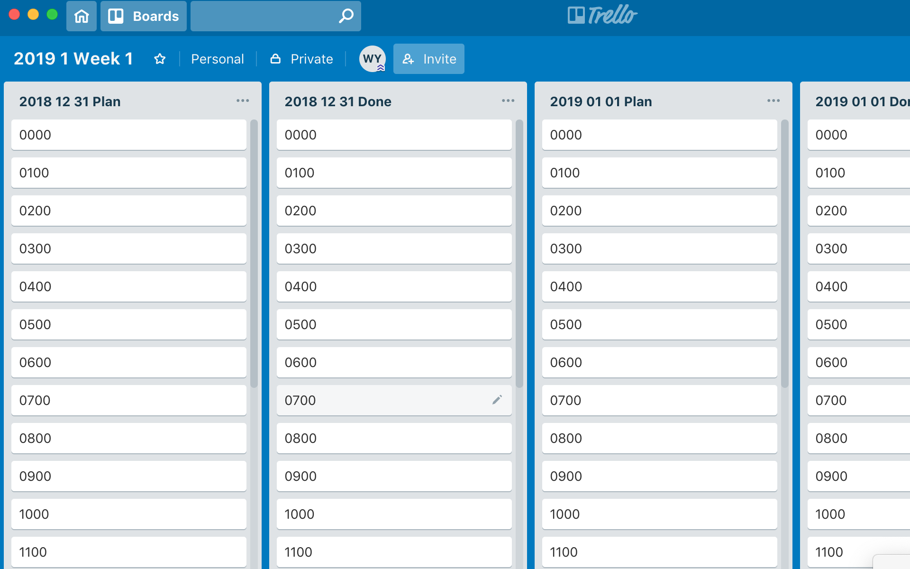
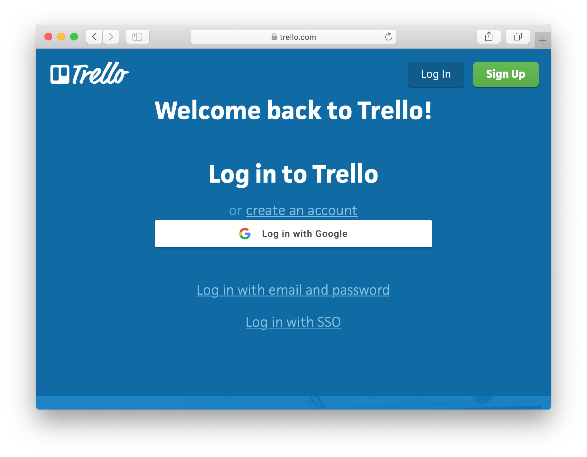
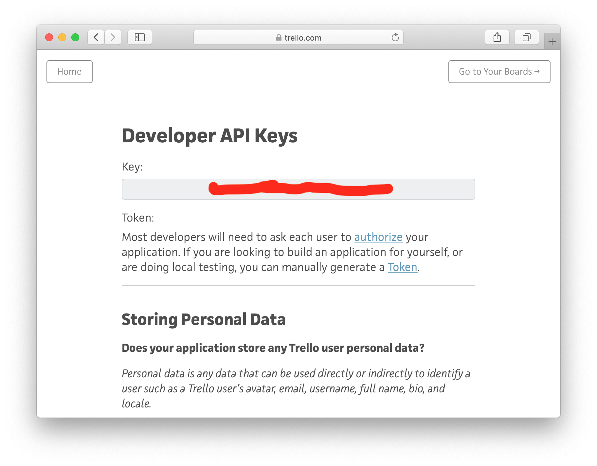
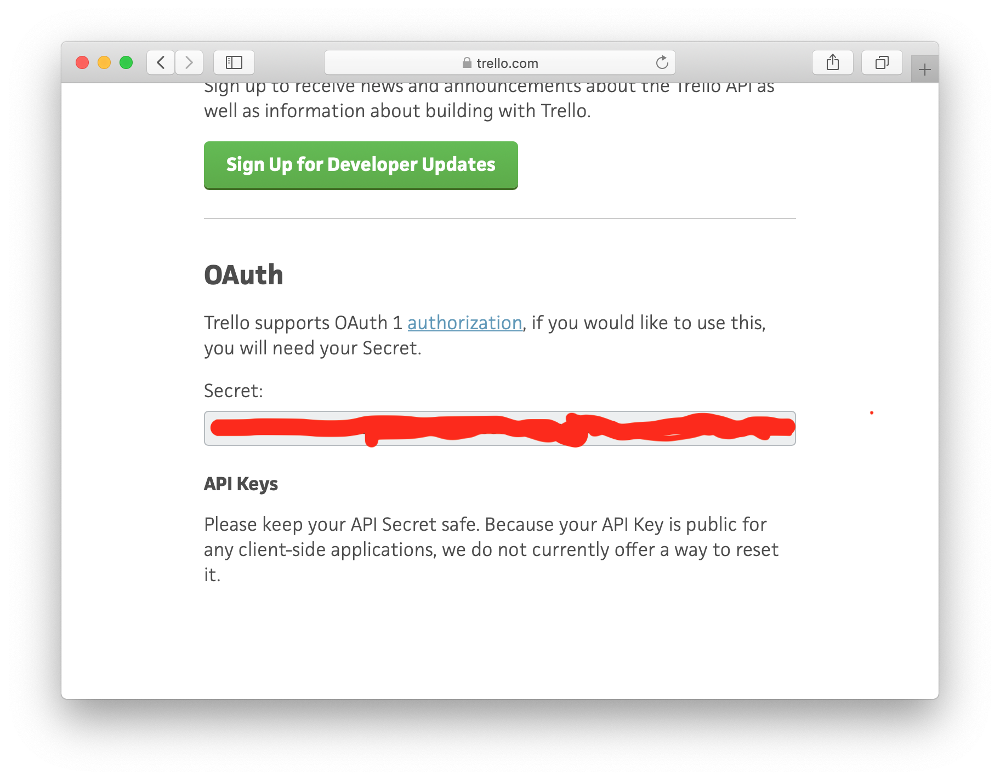

# trello-helper

This simple tool just helps me to create board in my desired format inside trello.



## Installation
1. git clone https://www.github.com/pakyinw/trello-helper-v0

2. Get your key and secret from Trello at (https://trello.com/app-key)

    * Log in trello.com (https://trello.com)
      
    * Copy the key.
      
    * Copy the secret.
      
    * Rename .env.sample to .env
    * Paste them on the .env file
      

3. Install packages
```
npm install
```

## Run
Start the server.
```
npm start
```

Open the browser.
```
http://localhost:3000
```

## Design
(design/README.md)


